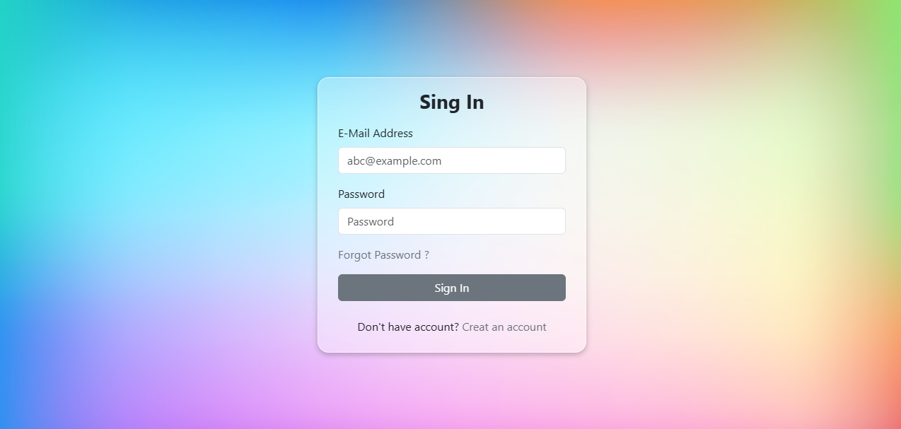
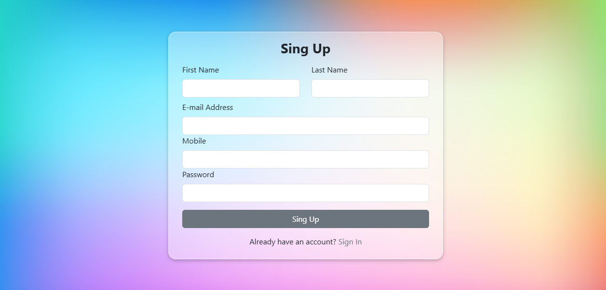
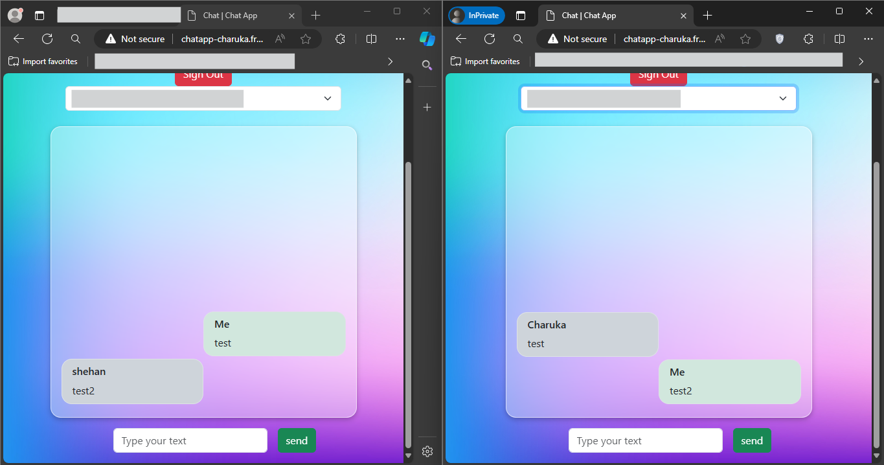

# PHP Chat Application

A simple and efficient chat application built with PHP, HTML, and JavaScript. This application allows users to communicate in real-time through a web-based interface.

## Features

- Real-time messaging
- User authentication (login/register)
- User-friendly interface
- Message notifications
- Chat history

## Demo





## Installation

1. **Clone the repository:**
    ```sh
    git clone https://github.com/charuka-dilshan/Basic-Chat-Application.git
    cd Basic-Chat-Application
    ```

2. **Install dependencies:**
    - Ensure you have PHP and a web server (e.g., Apache) installed.
    - Install Composer dependencies:
        ```sh
        composer install
        ```

3. **Set up the database:**
    - Create a MySQL database.
    - Import the `database.sql` file into your database:
        ```sh
        mysql -u username -p database_name < database.sql
        ```

4. **Configure the application:**
    - Rename the `.env.example` file to `.env` and update the database credentials and other settings.

5. **Start the application:**
    - Start your web server and navigate to the application URL (e.g., `http://localhost/Basic-Chat-Application`).

## Usage

1. **Register an account:**
    - Go to the registration page and create a new account.

2. **Log in:**
    - Use your credentials to log in to the chat application.

3. **Start chatting:**
    - Select a user from the user list and start sending messages in real-time.

## Contributing

Contributions are welcome! Please follow these steps:

1. Fork the repository.
2. Create a new branch (`git checkout -b feature/your-feature-name`).
3. Commit your changes (`git commit -m 'Add some feature'`).
4. Push to the branch (`git push origin feature/your-feature-name`).
5. Create a new Pull Request.

## Live on

This project is live.Check it out in [here](http://chatapp-charuka.free.nf/)

## Contact

For any inquiries, please contact [personal.charuka@gmail.com](mailto:personal.charuka@gmail.com).

---

Feel free to modify and extend this README to suit your specific project requirements.
